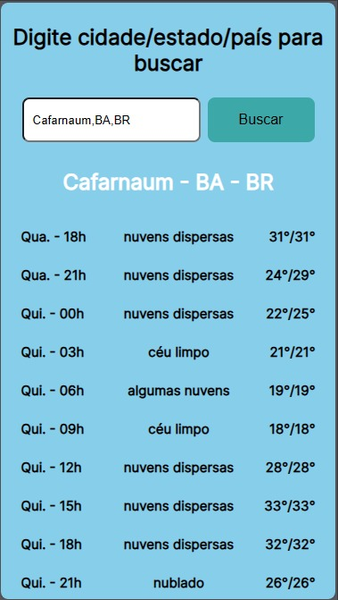

# Initialization

This project was started with [Create React App](https://github.com/facebook/create-react-app).

## Scripts

In the project directory, you can run:

### `npm start`

Runs the app in the development mode.\
Open [http://localhost:3000](http://localhost:3000) to view it in the browser.

The page will reload if you make edits.\
You will also see any lint errors in the console.

## About
Project to see forecast in the next five days. \
Firstly, the user can search a city. Example: London,ENG,UK. \
Then, the fist API will deliver the coordinates (latitude and longitude), which are the informations necessary to make a get to the second API, and this one, deliver the forecasts for the next five days. \
The forecasts already searched, are saved on redux.

## Technologies
- React
- Typescript
- Styled-components
- Axios
- React redux
- Redux-toolkit
- Dotenv

# Preview
